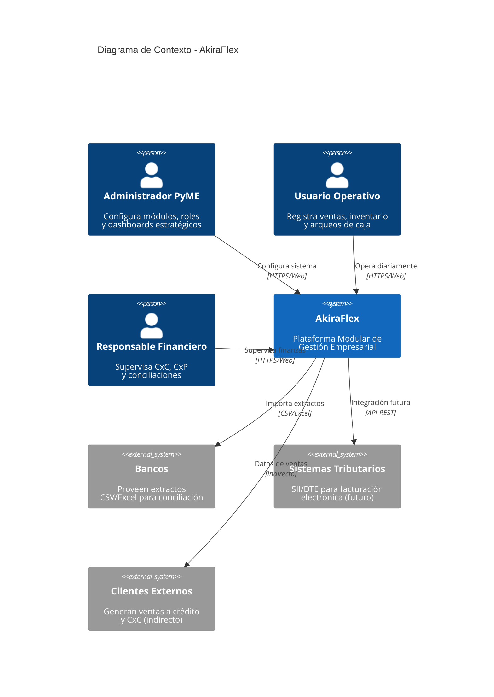
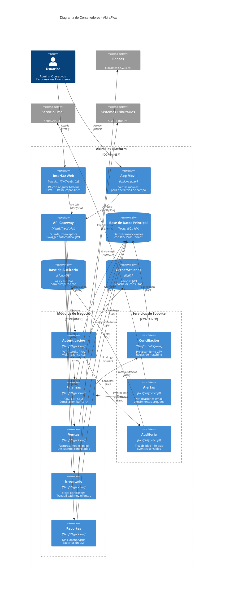

# Diagramas de Arquitectura - AkiraFlex

> **Modelo C4 (Context, Containers, Components, Code)** para AkiraFlex
> **Estándar:** ISO/IEC/IEEE 42010 - Architecture Description
> **Herramientas:** Mermaid, Lucidchart, Draw.io compatibles

---

## 1. Diagrama de Contexto (C4 - Nivel 1)

### Propósito

Muestra cómo **AkiraFlex** interactúa con usuarios externos y sistemas de terceros desde una perspectiva de alto nivel.

### Stakeholders

- **Administradores de PyMEs**: Configuran módulos, roles y dashboards estratégicos
- **Usuarios Operativos**: Registran ventas, gestionan inventario y realizan arqueos
- **Responsables Financieros**: Supervisan flujo de caja, CxC, CxP y conciliaciones
- **Sistemas Externos**: Bancos, sistemas tributarios y clientes



### Descripción Detallada

| **Actor/Sistema** | **Responsabilidad** | **Interacción con AkiraFlex** |
|-------------------|---------------------|-------------------------------|
| **Administrador PyME** | Configuración estratégica del sistema | • Activar/desactivar módulos por plan<br/>• Gestionar roles y permisos<br/>• Ver dashboards ejecutivos |
| **Usuario Operativo** | Operaciones diarias del negocio | • Registrar ventas y medios de pago<br/>• Gestionar inventario y stock<br/>• Realizar arqueos de caja |
| **Responsable Financiero** | Supervisión y control financiero | • Conciliación bancaria<br/>• Gestión CxC/CxP<br/>• Análisis de KPIs (DSO/DPO) |
| **Bancos** | Proveedor de datos financieros | • Extractos bancarios (CSV/Excel)<br/>• Movimientos para conciliación |
| **Sistemas Tributarios** | Cumplimiento regulatorio (futuro) | • Facturación electrónica<br/>• Reportes tributarios |
| **Clientes Externos** | Origen de transacciones comerciales | • Ventas a crédito<br/>• Datos indirectos via CxC |

---

## **🎯 RECOMENDACIÓN: NestJS para API Gateway**

### **Análisis Técnico: NestJS vs Express**

#### **✅ RECOMENDADO: NestJS API Gateway**

**Ventajas para AkiraFlex:**

```typescript
// Ejemplo: Guard de autenticación automático
@Injectable()
export class JwtAuthGuard extends AuthGuard('jwt') {
  canActivate(context: ExecutionContext): boolean {
    // Lógica multi-tenant automática
    const request = context.switchToHttp().getRequest();
    return super.canActivate(context) && this.validateTenant(request);
  }
}

// Controlador con decoradores integrados
@Controller('finance')
@UseGuards(JwtAuthGuard, RoleGuard)
@ApiTags('Finance')
export class FinanceController {
  @Post('cash-closure')
  @Roles('cashier', 'supervisor')
  @ApiOperation({ summary: 'Cerrar caja diaria' })
  async closeCash(@Body() dto: CashClosureDto) {
    // Validación automática con class-validator
    // Swagger documentation automática
    // Rate limiting con @Throttle()
  }
}
```

**Beneficios específicos:**

1. **Arquitectura uniforme** - Mismo framework frontend (Angular) y backend
2. **TypeScript nativo** - Type safety end-to-end sin configuración
3. **Decoradores integrados** - Guards, Interceptors, Pipes automáticos
4. **Swagger automático** - Documentación API sin esfuerzo extra
5. **Dependency Injection** - IoC container profesional
6. **Modularidad nativa** - Perfect match para arquitectura modular
7. **Rate limiting built-in** - @nestjs/throttler para multi-tenant
8. **Testing integrado** - Mocking y DI para unit/integration tests

#### **⚠️ Alternativa: Express Gateway**

**Cuándo considerar Express:**

```javascript
// Mayor flexibilidad para casos edge
const app = express();

// Control manual total sobre middlewares
app.use(customTenantMiddleware);
app.use(customAuthMiddleware);
app.use(customRateLimiter);

// Ecosistema más amplio
app.use(helmet()); // Seguridad
app.use(compression()); // Compresión
app.use(morgan('combined')); // Logging
```

**Desventajas para AkiraFlex:**

1. **Configuración manual** - Todo debe codificarse desde cero
2. **Inconsistencia de stack** - Angular + Express = diferente paradigma
3. **Sin type safety automático** - Requiere configuración manual TypeScript
4. **Swagger manual** - Documentación API requiere herramientas externas
5. **Testing manual** - Sin DI, mocking más complejo
6. **Rate limiting manual** - Implementación custom para multi-tenant

### **Decisión Técnica Final**

**✅ RECOMENDACIÓN: NestJS API Gateway + NestJS Backend Services**

**Justificación:**

1. **Consistencia arquitectónica** - Angular + NestJS = ecosistema TypeScript unificado
2. **Reducción de complejidad** - Decoradores automatizan cross-cutting concerns
3. **Time-to-market** - Desarrollo más rápido con features built-in
4. **Mantenibilidad** - Código más limpio y autodocumentado
5. **Escalabilidad** - Arquitectura modular nativa facilita growth
6. **Team velocity** - Un solo stack tecnológico = menos curva de aprendizaje

---

## 2. Diagrama de Contenedores (C4 - Nivel 2)

### Propósito

Detalla los **componentes técnicos principales** de AkiraFlex, mostrando la arquitectura modular interna y las tecnologías utilizadas.

### Arquitectura Multi-Tenant con Separación de Responsabilidades



### Stack Tecnológico Detallado

#### **Frontend & UI**

```yaml
Tecnología: Angular 17+ con TypeScript
Características:
  - SPA (Single Page Application) con Angular Universal (SSR)
  - Angular Material para componentes UI
  - State Management: NgRx (Redux pattern) o Akita
  - Routing: Angular Router con guards
  - Build: Angular CLI + esbuild
  - Testing: Jasmine + Karma + Cypress (E2E)
  - PWA: Service Workers para offline capabilities
```

#### **Backend & API Gateway**

```yaml
Tecnología: NestJS 10+ con TypeScript (Recomendado)
Características:
  - Arquitectura modular con decoradores
  - Autenticación JWT + Guards integrados
  - Rate limiting con @nestjs/throttler
  - Swagger/OpenAPI automático
  - Validación con class-validator
  - Interceptors para logging y transformación
  - Exception filters personalizados
  - Dependency Injection nativo

Alternativa: Express.js 4.x
Características:
  - Mayor flexibilidad y control manual
  - Ecosistema más amplio de middlewares
  - Menor overhead para casos simples
  - Configuración manual de autenticación/validación
```

#### **Módulos de Negocio**

```yaml
Arquitectura: NestJS Modular Monolith
Runtime: Node.js 18+ con NestJS Framework
Características:
  - Módulos separados por dominio (@Module decorator)
  - Guards para autenticación/autorización
  - Pipes para validación y transformación
  - Interceptors para cross-cutting concerns
  - Repository pattern con TypeORM
  - Services con Dependency Injection
  - DTOs con class-validator
  - Event-driven con @nestjs/event-emitter
```

#### **Base de Datos**

```yaml
Principal: PostgreSQL 15+
Características:
  - Row Level Security (RLS) para multi-tenancy
  - Índices optimizados para consultas financieras
  - Particionado por tenant para escalabilidad
  - Backup automático diario
  - Réplicas de lectura para reportes

Auditoría: MongoDB 6+
Características:
  - Colecciones por tipo de evento
  - TTL index para retención 180 días
  - Sharding preparado para escala
  - Índices por userId, tenantId, timestamp

Cache: Redis 7+
Características:
  - Sesiones JWT con expiración
  - Cache de consultas frecuentes (KPIs)
  - Rate limiting counters
  - Real-time notifications pub/sub
```

---

## 3. Diagrama de Componentes - Módulo Finanzas (C4 - Nivel 3)

### Propósito

Detalla la **estructura interna del módulo más crítico** (Finanzas) mostrando componentes, flujos de datos y reglas de negocio.

```mermaid
C4Component
    title Componentes del Módulo Finanzas - AkiraFlex

    Container_Boundary(finance_module, "Módulo Finanzas") {
        Component(finance_controller, "Finance Controller", "Express Router", "API endpoints para<br/>operaciones financieras")

        Component_Boundary(services, "Servicios de Negocio") {
            Component(cash_service, "Cash Service", "Node.js", "Arqueo y cierre<br/>de caja diario")
            Component(ar_service, "Accounts Receivable", "Node.js", "CxC, aging, alertas<br/>políticas de crédito")
            Component(ap_service, "Accounts Payable", "Node.js", "CxP, calendario<br/>anti-duplicados")
            Component(reconciliation_service, "Reconciliation Service", "Node.js", "Coordinador de<br/>conciliación bancaria")
        }

        Component_Boundary(repositories, "Acceso a Datos") {
            Component(cash_repo, "Cash Repository", "TypeORM", "Movimientos de caja<br/>arqueos, evidencias")
            Component(ar_repo, "AR Repository", "TypeORM", "Facturas, pagos<br/>promesas de pago")
            Component(ap_repo, "AP Repository", "TypeORM", "Facturas proveedores<br/>órdenes de pago")
            Component(bank_repo, "Bank Repository", "TypeORM", "Extractos bancarios<br/>transacciones")
        }

        Component_Boundary(external_services, "Servicios Externos") {
            Component(csv_processor, "CSV Processor", "Python/Pandas", "Parsing y validación<br/>de extractos bancarios")
            Component(matching_engine, "Matching Engine", "Python", "Algoritmos de<br/>conciliación automática")
            Component(notification_service, "Notification Service", "Node.js", "Alertas CxC/CxP<br/>diferencias de arqueo")
        }
    }

    ContainerDb(postgres, "PostgreSQL", "Base de datos", "Tablas financieras<br/>con RLS")
    Container(audit_service, "Auditoría", "MongoDB", "Eventos financieros<br/>sensibles")
    Container(email_service, "Email Service", "External", "Envío de alertas<br/>y recordatorios")

    Rel(finance_controller, cash_service, "Operaciones caja", "sync")
    Rel(finance_controller, ar_service, "Operaciones CxC", "sync")
    Rel(finance_controller, ap_service, "Operaciones CxP", "sync")
    Rel(finance_controller, reconciliation_service, "Conciliación", "async")

    Rel(cash_service, cash_repo, "CRUD caja", "SQL")
    Rel(ar_service, ar_repo, "CRUD CxC", "SQL")
    Rel(ap_service, ap_repo, "CRUD CxP", "SQL")
    Rel(reconciliation_service, bank_repo, "CRUD bancos", "SQL")

    Rel(cash_repo, postgres, "Query/Insert", "TCP")
    Rel(ar_repo, postgres, "Query/Insert", "TCP")
    Rel(ap_repo, postgres, "Query/Insert", "TCP")
    Rel(bank_repo, postgres, "Query/Insert", "TCP")

    Rel(reconciliation_service, csv_processor, "Procesa archivo", "HTTP")
    Rel(csv_processor, matching_engine, "Datos limpios", "JSON")
    Rel(matching_engine, reconciliation_service, "Resultados", "JSON")

    Rel(ar_service, notification_service, "Alertas vencimiento", "Event")
    Rel(ap_service, notification_service, "Alertas pago", "Event")
    Rel(cash_service, notification_service, "Diferencias arqueo", "Event")
    Rel(notification_service, email_service, "Send email", "API")

    Rel(cash_service, audit_service, "Eventos caja", "Event")
    Rel(ar_service, audit_service, "Eventos CxC", "Event")
    Rel(ap_service, audit_service, "Eventos CxP", "Event")
```

### Reglas de Negocio Críticas

#### **1. Arqueo de Caja (Cash Service)**

```typescript
interface CashClosureRules {
    // Diferencia máxima permitida sin autorización
    maxDifferenceWithoutApproval: number; // ej: $5.000 CLP

    // Requiere evidencias si supera umbral
    evidenceRequiredThreshold: number; // ej: $1.000 CLP

    // Bloquea nuevas ventas hasta reapertura
    blockSalesAfterClosure: boolean; // true

    // Notifica supervisor si hay diferencias
    notifySupervisorOnDifference: boolean; // true
}
```

#### **2. Cuentas por Cobrar (AR Service)**

```typescript
interface CreditPolicyRules {
    // Límite de crédito por cliente
    clientCreditLimit: Map<string, number>;

    // Días de mora antes de bloqueo automático
    daysBeforeAutoBlock: number; // ej: 60 días

    // Segmentos de aging
    agingBuckets: [0-30, 31-60, 61-90, 90+];

    // Requiere autorización si supera límite
    requireApprovalOverLimit: boolean; // true
}
```

#### **3. Conciliación Bancaria (Reconciliation Service)**

```typescript
interface MatchingRules {
    // Tolerancia para matching por monto
    amountTolerance: number; // ej: $100 CLP

    // Ventana de días para matching por fecha
    dateTolerance: number; // ej: ±3 días

    // Score mínimo para auto-matching
    minMatchingScore: number; // ej: 0.85 (85%)

    // Patrones de referencia conocidos
    referencePatterns: RegExp[];
}
```

---

## 4. Diagrama de Despliegue (C4 - Nivel 4)

### Propósito

Muestra cómo los componentes se despliegan en **infraestructura real**, considerando escalabilidad, seguridad y disponibilidad (SLO 99.5%).

```mermaid
C4Deployment
    title Diagrama de Despliegue - AkiraFlex (AWS Cloud)

    Deployment_Node(internet, "Internet", "Public Network") {
        Deployment_Node(cdn, "CloudFront CDN", "AWS CloudFront") {
            Container(static_assets, "Static Assets", "React Build", "JS, CSS, Images<br/>Global distribution")
        }
    }

    Deployment_Node(aws_cloud, "AWS Cloud", "us-east-1 (Primary)") {
        Deployment_Node(public_subnet, "Public Subnet", "10.0.1.0/24") {
            Deployment_Node(alb, "Application Load Balancer", "AWS ALB") {
                Container(load_balancer, "ALB", "Layer 7", "TLS termination<br/>Health checks")
            }
        }

        Deployment_Node(private_subnet_app, "Private Subnet - Apps", "10.0.2.0/24") {
            Deployment_Node(ecs_cluster, "ECS Fargate Cluster", "Container Orchestration") {
                Container(api_gateway_container, "API Gateway", "Docker", "2 vCPU, 4GB RAM<br/>Auto-scaling 2-10 tasks")
                Container(auth_container, "Auth Service", "Docker", "1 vCPU, 2GB RAM<br/>Auto-scaling 2-6 tasks")
                Container(finance_container, "Finance Service", "Docker", "2 vCPU, 4GB RAM<br/>Auto-scaling 2-8 tasks")
                Container(other_services, "Other Services", "Docker", "Sales, Inventory, Reports<br/>1 vCPU, 2GB RAM each")
            }
        }

        Deployment_Node(private_subnet_data, "Private Subnet - Data", "10.0.3.0/24") {
            Deployment_Node(rds_cluster, "RDS PostgreSQL", "Multi-AZ Cluster") {
                ContainerDb(postgres_primary, "Primary DB", "PostgreSQL 15", "db.r6g.large<br/>Read/Write")
                ContainerDb(postgres_replica, "Read Replica", "PostgreSQL 15", "db.r6g.large<br/>Read-only (Reports)")
            }

            Deployment_Node(elasticache, "ElastiCache", "Redis Cluster") {
                ContainerDb(redis_primary, "Redis Primary", "cache.r7g.large", "Sessions, Cache")
                ContainerDb(redis_replica, "Redis Replica", "cache.r7g.large", "Failover ready")
            }

            Deployment_Node(documentdb, "DocumentDB", "MongoDB Compatible") {
                ContainerDb(mongodb_cluster, "Audit Logs", "docdb.r6g.large", "3-node cluster<br/>Audit trail")
            }
        }
    }

    Deployment_Node(monitoring, "Observability", "AWS Services") {
        Container(cloudwatch, "CloudWatch", "Metrics & Logs", "System metrics<br/>Application logs")
        Container(xray, "X-Ray", "Distributed Tracing", "Request tracing<br/>Performance analysis")
        Container(sns_sqs, "SNS/SQS", "Messaging", "Async processing<br/>Email notifications")
    }

    Deployment_Node(security, "Security", "AWS Services") {
        Container(waf, "WAF", "Web Application Firewall", "DDoS protection<br/>SQL injection prevention")
        Container(secrets_manager, "Secrets Manager", "Credential Storage", "DB passwords<br/>API keys rotation")
        Container(iam, "IAM", "Identity Management", "Service roles<br/>Least privilege access")
    }

    System_Ext(users, "Users", "Web browsers<br/>Mobile apps")
    System_Ext(banks, "Banks", "CSV/Excel files")
    System_Ext(email_provider, "Email Provider", "SendGrid/SES")

    Rel(users, cdn, "HTTPS requests", "443")
    Rel(cdn, alb, "API requests", "443")
    Rel(alb, api_gateway_container, "Load balancing", "HTTP/2")

    Rel(api_gateway_container, auth_container, "Authentication", "HTTP")
    Rel(api_gateway_container, finance_container, "Finance APIs", "HTTP")
    Rel(api_gateway_container, other_services, "Business APIs", "HTTP")

    Rel(auth_container, postgres_primary, "User data", "5432")
    Rel(auth_container, redis_primary, "Sessions", "6379")

    Rel(finance_container, postgres_primary, "Transactions", "5432")
    Rel(other_services, postgres_replica, "Reports", "5432")

    Rel(finance_container, mongodb_cluster, "Audit events", "27017")
    Rel(auth_container, mongodb_cluster, "Auth events", "27017")

    Rel(finance_container, sns_sqs, "Email triggers", "HTTPS")
    Rel(sns_sqs, email_provider, "Send emails", "SMTP/API")

    Rel(api_gateway_container, cloudwatch, "Metrics", "CloudWatch API")
    Rel(finance_container, xray, "Traces", "UDP")
```

### Especificaciones de Infraestructura

#### **Compute (ECS Fargate)**

```yaml
API Gateway (NestJS):
  CPU: 2 vCPU (2048 units)
  Memory: 4GB
  Auto-scaling: 2-10 tasks
  Health check: /health endpoint (built-in)
  Framework: NestJS + Express under the hood

Finance Service (NestJS):
  CPU: 2 vCPU (2048 units)
  Memory: 4GB
  Auto-scaling: 2-8 tasks
  Priority: High (critical path)
  TypeScript: Compiled to optimized JS

Auth Service (NestJS):
  CPU: 1 vCPU (1024 units)
  Memory: 2GB
  Auto-scaling: 2-6 tasks
  SLA: 99.9% availability
  JWT Strategy: Built-in Passport integration

Other Services (NestJS):
  CPU: 1 vCPU (1024 units)
  Memory: 2GB
  Auto-scaling: 2-4 tasks each
  Modules: Sales, Inventory, Reports
```

#### **Database (RDS PostgreSQL)**

```yaml
Primary Instance:
  Class: db.r6g.large (2 vCPU, 16GB)
  Storage: 500GB GP3 SSD
  IOPS: 3000 provisioned
  Multi-AZ: Enabled
  Backup: 7 days retention

Read Replica:
  Class: db.r6g.large
  Purpose: Reports and analytics
  Cross-AZ: Different AZ from primary

Connection Pool:
  Max connections: 200
  Pool size per service: 10-20
```

#### **Cache (ElastiCache Redis)**

```yaml
Primary Cluster:
  Node type: cache.r7g.large (2 vCPU, 13GB)
  Cluster mode: Enabled
  Nodes: 3 shards, 1 replica each

Use Cases:
  - JWT session storage (TTL: 24h)
  - Frequently accessed KPIs (TTL: 5min)
  - Rate limiting counters (TTL: 1h)
  - Real-time notifications pub/sub
```

#### **Monitoring & Observability**

```yaml
CloudWatch:
  - Custom metrics: DSO, DPO, conciliation rate
  - Log retention: 30 days (application), 180 days (audit)
  - Alarms: Error rate >1%, Latency >300ms p95

X-Ray:
  - Distributed tracing for all HTTP requests
  - Performance analysis for slow queries
  - Service map visualization

SNS/SQS:
  - Dead letter queues for failed notifications
  - Message retention: 14 days
  - Batch processing for email alerts
```

---

## 5. Patrones de Arquitectura Aplicados

### **1. Multi-Tenant con Row Level Security (RLS)**

```sql
-- Política RLS para aislamiento por empresa
CREATE POLICY tenant_isolation ON financial_transactions
FOR ALL TO application_role
USING (tenant_id = current_setting('app.current_tenant_id')::uuid);

-- Configuración por sesión
SET app.current_tenant_id = '12345678-1234-1234-1234-123456789012';
```

### **2. Event-Driven Architecture**

```typescript
// Ejemplo: Evento de cierre de caja
interface CashClosedEvent {
  eventType: 'CASH_CLOSED';
  tenantId: string;
  branchId: string;
  cashierId: string;
  closureAmount: number;
  difference: number;
  timestamp: Date;
}

// Subscribers
class AuditEventHandler {
  handle(event: CashClosedEvent) {
    // Registrar en auditoría
  }
}

class AlertEventHandler {
  handle(event: CashClosedEvent) {
    if (event.difference > THRESHOLD) {
      // Enviar alerta a supervisor
    }
  }
}
```

### **3. CQRS para Reportes**

```typescript
// Command side (escritura)
class CreateSaleCommand {
  execute(sale: Sale): Promise<void> {
    // Validar y guardar en PostgreSQL
  }
}

// Query side (lectura)
class SalesReportQuery {
  getKPIs(tenantId: string): Promise<SalesKPIs> {
    // Consulta optimizada, posible cache
  }
}
```

### **4. Circuit Breaker para Servicios Externos**

```typescript
class BankConciliationService {
  private circuitBreaker = new CircuitBreaker(
    this.processCSV.bind(this),
    {
      timeout: 30000, // 30 segundos
      errorThresholdPercentage: 50,
      resetTimeout: 60000 // 1 minuto
    }
  );

  async reconcile(csvFile: Buffer): Promise<ReconciliationResult> {
    return this.circuitBreaker.fire(csvFile);
  }
}
```

---

## 6. Criterios de Calidad Arquitectónica

### **Performance**

- ✅ p95 < 300ms para KPIs financieros
- ✅ Throughput: >100 RPS en endpoints críticos
- ✅ Cache hit rate: >80% para consultas frecuentes
- ✅ DB connection pool tuning para concurrencia

### **Scalability**

- ✅ Auto-scaling horizontal de contenedores
- ✅ Database sharding preparado por tenant_id
- ✅ CDN para assets estáticos globalmente
- ✅ Load balancer con health checks

### **Reliability**

- ✅ Multi-AZ deployment para HA (99.5% SLO)
- ✅ Database backup automático (RTO ≤ 1h, RPO ≤ 15min)
- ✅ Circuit breakers para servicios externos
- ✅ Retry mechanisms con exponential backoff

### **Security**

- ✅ TLS 1.2+ end-to-end encryption
- ✅ WAF para protección DDoS y inyección SQL
- ✅ Secrets rotation automática
- ✅ Network isolation con VPC privadas
- ✅ Audit trail completo (180 días retención)

### **Maintainability**

- ✅ Modular architecture con bounded contexts
- ✅ Clean code practices y SOLID principles
- ✅ Infrastructure as Code (Terraform/CloudFormation)
- ✅ Comprehensive logging y distributed tracing
- ✅ API documentation con OpenAPI 3.0

---

## 7. Próximos Pasos de Implementación

### **Fase 1: Infraestructura Base (Semanas 1-2)**

1. ✅ Setup AWS account y VPC
2. ✅ RDS PostgreSQL con RLS configurado
3. ✅ ECS cluster y ALB básico
4. ✅ CI/CD pipeline con GitHub Actions

### **Fase 2: Servicios Core (Semanas 3-6)**

1. ✅ Auth Service con JWT multi-tenant
2. ✅ API Gateway con rate limiting
3. ✅ Finance Service MVP (arqueo, CxC básico)
4. ✅ Monitoring y alertas básicas

### **Fase 3: Módulos de Negocio (Semanas 7-12)**

1. ✅ Sales Service integrado con Finance
2. ✅ Inventory Service con trazabilidad
3. ✅ Conciliación bancaria automatizada
4. ✅ Reports Service con KPIs

### **Fase 4: Especialización Cliente (Semanas 13-16)**

1. ✅ Módulos específicos RepUSA (Agenda/Citas)
2. ✅ Módulos específicos Joyas Origen (Producción)
3. ✅ Testing integral y performance tuning
4. ✅ Go-live con usuarios piloto

---

## 8. Herramientas Recomendadas

### **Documentación y Diagramas**

- **Mermaid**: Para diagramas versionados en código
- **Lucidchart**: Para colaboración visual en equipo
- **Draw.io**: Alternativa gratuita integrada con GitHub
- **PlantUML**: Para diagramas de secuencia y clases

### **Validación Arquitectórica**

- **ADR Tools**: Para Architecture Decision Records
- **C4-PlantUML**: Templates para diagramas C4 estándar
- **Structurizr**: Para modelado arquitectónico avanzado

¿Te gustaría que profundice en algún diagrama específico o crear diagramas adicionales como secuencia de flujos críticos?
