# Diagramas de Flujo de Negocio - AkiraFlex

> **Diagramas de secuencia y flujos críticos** para los procesos más importantes del negocio
> **Herramientas**: Mermaid, BPMN-compatible
> **Casos de Uso**: RepUSA y Joyas Origen

---

## 1. Flujo de Arqueo de Caja (Proceso Crítico)

### Descripción

Proceso diario que debe ejecutar cada cajero al final de su turno para verificar que el dinero físico coincida con las ventas registradas.


### Reglas de Negocio

| **Umbral** | **Acción Automática** | **Requiere Aprobación** | **Notificación** |
|------------|----------------------|------------------------|------------------|
| ≤ $1,000 CLP | Cierre automático | ❌ | Solo log auditoría |
| $1,001 - $5,000 | Solicitar justificación | Supervisor | Email supervisor |
| > $5,000 CLP | Bloquear cierre | Gerente + justificación | SMS + email gerente |

---

## 2. Flujo de Conciliación Bancaria Automática

### Descripción

Proceso semanal donde el contador carga el extracto bancario y el sistema concilia automáticamente las transacciones.

```mermaid
sequenceDiagram
    participant CONT as Contador
    participant UI as Frontend
    participant API as API Gateway
    participant CONC as Servicio Conciliación
    participant CSV as Procesador CSV
    participant MATCH as Motor Matching
    participant DB as PostgreSQL
    participant AUDIT as Auditoría

    Note over CONT, AUDIT: Conciliación Bancaria Semanal - Joyas Origen

    CONT->>UI: 1. Cargar extracto CSV
    UI->>API: 2. POST /finance/reconciliation/upload
    activate API

    API->>CONC: 3. Procesar archivo CSV
    activate CONC

    CONC->>CSV: 4. Validar y parsear CSV
    activate CSV
    CSV->>CSV: 5. Validar formato y datos

    alt Archivo válido
        CSV-->>CONC: 6a. Datos limpios (50 transacciones)
        deactivate CSV

        CONC->>DB: 7. Consultar transacciones pendientes
        DB-->>CONC: 8. 45 movimientos sin conciliar

        CONC->>MATCH: 9. Ejecutar matching automático
        activate MATCH

        par Algoritmo de Matching
            MATCH->>MATCH: Por monto exacto ±$100
        and
            MATCH->>MATCH: Por fecha ±3 días
        and
            MATCH->>MATCH: Por patrón de referencia
        end

        MATCH-->>CONC: 10. Resultados: 38 matches automáticos
        deactivate MATCH

        CONC->>DB: 11. Guardar matches automáticos
        CONC->>AUDIT: 12. Log: RECONCILIATION_AUTO (38/50 = 76%)

        CONC-->>API: 13. Respuesta: 38 automáticos, 12 manuales
        deactivate CONC

        API-->>UI: 14. Mostrar resultados
        deactivate API

        UI-->>CONT: 15. Dashboard de conciliación
        Note over UI: 76% automático<br/>12 requieren revisión manual<br/>7 no encontrados

        CONT->>UI: 16. Revisar casos manuales

        loop Para cada transacción manual
            UI->>CONT: Mostrar sugerencias
            CONT->>UI: Aceptar/Rechazar/Crear manual
            UI->>API: Actualizar matching
        end

        CONT->>UI: 17. Confirmar conciliación
        UI->>API: 18. POST /finance/reconciliation/confirm
        API->>DB: 19. Marcar como conciliado
        API->>AUDIT: 20. Log: RECONCILIATION_COMPLETED

    else Archivo inválido
        CSV-->>CONC: 6b. Error: formato incorrecto
        deactivate CSV
        CONC-->>API: 7b. Error 400: CSV_INVALID_FORMAT
        deactivate CONC
        API-->>UI: 8b. Mostrar error con detalles
        deactivate API
        UI-->>CONT: 9b. "Línea 15: fecha inválida"
    end
```

### Algoritmo de Matching

```typescript
interface MatchingResult {
  score: number; // 0.0 - 1.0
  confidence: 'HIGH' | 'MEDIUM' | 'LOW';
  reasons: MatchingReason[];
}

interface MatchingRules {
  // Peso de cada criterio en el score final
  weights: {
    exactAmount: 0.4,      // Monto exacto
    amountTolerance: 0.3,  // Monto ±tolerancia
    dateProximity: 0.2,    // Cercanía en fechas
    referencePattern: 0.1  // Patrón en referencia
  };

  // Umbrales de decisión
  thresholds: {
    autoMatch: 0.85,       // Score para match automático
    suggestMatch: 0.60,    // Score para sugerencia
    minViable: 0.40        // Score mínimo para mostrar
  };
}
```

### Métricas de Éxito

| **KPI** | **Meta** | **Medición** |
|---------|----------|--------------|
| **Tasa de Conciliación Automática** | ≥80% | (Matches automáticos / Total transacciones) × 100 |
| **Tiempo de Procesamiento** | ≤2 min | Desde upload hasta resultados (5k líneas) |
| **Precisión de Matching** | ≥95% | Matches automáticos correctos vs revisión manual |
| **Tiempo de Conciliación Manual** | ≤30 min | Tiempo total proceso semanal |

---

## 3. Flujo de Orden de Trabajo - RepUSA

### Descripción

Proceso completo desde que el cliente agenda una cita hasta la facturación final, incluyendo consumo automático de repuestos.


### Estados de Orden de Trabajo


### Integración de Datos

| **Módulo** | **Datos que Recibe** | **Datos que Envía** |
|------------|---------------------|-------------------|
| **Agenda** | Disponibilidad técnicos, tipos servicio | Citas confirmadas |
| **Orden de Trabajo** | Cita, diagnóstico técnico | Consumos, tiempos |
| **Inventario** | Solicitud repuestos | Stock disponible, costos |
| **Ventas** | OT completada, productos/servicios | Factura, totales |
| **Finanzas** | Venta confirmada | Movimiento caja/CxC |

---

## 4. Flujo de Producción por Receta - Joyas Origen

### Descripción

Proceso de producción artesanal donde se crea una orden de trabajo basada en recetas predefinidas, consumiendo insumos automáticamente.

```mermaid
sequenceDiagram
    participant CLIENTE as Cliente
    participant VEND as Vendedor
    participant PROD as Jefe Producción
    participant OT as Servicio Producción
    participant INV as Servicio Inventario
    participant REC as Repository Recetas
    participant ART as Artesano
    participant DB as Base de Datos

    Note over CLIENTE, DB: Producción Personalizada - Joyas Origen

    %% 1. Pedido personalizado
    CLIENTE->>VEND: 1. Solicita anillo oro 18k personalizado
    VEND->>REC: 2. Consultar receta base "Anillo Clásico"
    REC->>DB: 3. Query receta + insumos
    DB-->>REC: 4. Oro 18k: 8g, Trabajo: 6h
    REC-->>VEND: 5. Receta encontrada

    VEND->>CLIENTE: 6. Cotización: $280,000 (entrega 10 días)
    CLIENTE->>VEND: 7. Acepta + anticipo $140,000
    VEND->>OT: 8. Crear pedido personalizado
    OT->>DB: 9. Guardar pedido + anticipo

    %% 2. Planificación de producción
    PROD->>OT: 10. Revisar pedidos pendientes
    OT->>DB: 11. Query pedidos sin programar
    DB-->>OT: 12. Pedido #PED-2024-089 pendiente

    PROD->>INV: 13. Verificar insumos disponibles
    INV->>DB: 14. Query stock oro 18k
    DB-->>INV: 15. Stock: 25g disponibles
    INV-->>PROD: 16. Insumos suficientes

    PROD->>OT: 17. Crear Orden de Trabajo OT-2024-045
    OT->>DB: 18. INSERT orden_trabajo_produccion
    OT->>INV: 19. Reservar insumos (8g oro 18k)
    INV->>DB: 20. UPDATE stock_reservado

    %% 3. Proceso de producción
    ART->>OT: 21. Iniciar OT-2024-045
    OT->>DB: 22. UPDATE estado = 'EN_PRODUCCION'
    OT->>INV: 23. Solicitar entrega insumos
    INV->>ART: 24. Entregar 8g oro 18k a estación
    INV->>DB: 25. Movimiento: reservado → consumido

    Note over ART: Día 1-7: Proceso artesanal<br/>- Fundición y moldeado<br/>- Engaste<br/>- Pulido final

    ART->>OT: 26. Registrar avance diario
    OT->>DB: 27. UPDATE progreso_porcentaje

    %% 4. Finalización y costeo
    ART->>OT: 28. Producto terminado
    OT->>DB: 29. UPDATE estado = 'COMPLETADO'

    OT->>OT: 30. Calcular costo real
    Note over OT: Insumos: $180,000<br/>Mano obra: $60,000 (10h)<br/>Costo real: $240,000 vs $238,000 estimado

    OT->>DB: 31. Guardar costeo final
    OT->>INV: 32. Dar entrada producto terminado
    INV->>DB: 33. Agregar anillo a inventario PT

    %% 5. Entrega y facturación final
    VEND->>CLIENTE: 34. Notificar producto listo
    CLIENTE->>VEND: 35. Llega a retirar
    VEND->>OT: 36. Confirmar entrega
    OT->>INV: 37. Salida producto terminado
    INV->>DB: 38. Movimiento salida PT

    VEND->>CLIENTE: 39. Cobrar saldo: $140,000
    VEND->>DB: 40. Registrar venta final
    Note over DB: Anticipo: $140,000<br/>Saldo: $140,000<br/>Total: $280,000<br/>Margen: $40,000 (14.3%)
```



### Estructura de Recetas

```yaml
# Ejemplo de receta para anillo clásico
receta_id: "REC-ANILLO-CLASICO-001"
nombre: "Anillo Clásico Oro 18k"
categoria: "Anillos"
tiempo_estimado: 360 # minutos (6 horas)

insumos:
  - codigo: "ORO-18K"
    descripcion: "Oro 18 kilates"
    cantidad: 8
    unidad: "gramos"
    costo_unitario: 22500 # CLP por gramo

  - codigo: "PIEDRA-CZ"
    descripcion: "Circonia cúbica 5mm"
    cantidad: 1
    unidad: "pieza"
    costo_unitario: 8000

proceso:
  - paso: 1
    descripcion: "Fundición y preparación aleación"
    tiempo: 60 # minutos

  - paso: 2
    descripcion: "Moldeado y conformado básico"
    tiempo: 120

  - paso: 3
    descripcion: "Engaste de piedra"
    tiempo: 90

  - paso: 4
    descripcion: "Pulido y acabado final"
    tiempo: 90

costo_estimado:
  insumos: 188000 # 8g × 22500 + 8000
  mano_obra: 50000 # 6h × 8333/hora
  total: 238000

margen_sugerido: 0.20 # 20%
precio_venta: 285600
```

### Control de Costos por OT

```mermaid
graph TD
    A[Orden de Trabajo] --> B[Costo Estándar]
    A --> C[Costo Real]

    B --> B1[Insumos Receta]
    B --> B2[Mano Obra Estimada]
    B --> B3[Overhead Asignado]

    C --> C1[Insumos Consumidos]
    C --> C2[Horas Reales]
    C --> C3[Overhead Real]

    B1 --> D[Variación Insumos]
    C1 --> D

    B2 --> E[Variación M.O.]
    C2 --> E

    D --> F[Análisis Rentabilidad]
    E --> F

    F --> G{¿Variación > 5%?}
    G -->|Sí| H[Alerta Jefe Producción]
    G -->|No| I[Registro Normal]

    H --> J[Revisar Proceso]
    I --> K[Cerrar OT]
```



---

## 5. Flujo de Alertas y Notificaciones

### Descripción

Sistema centralizado de alertas para eventos críticos del negocio que requieren acción inmediata.


### Matriz de Alertas por Tipo

| **Tipo de Alerta** | **Prioridad** | **SLA Respuesta** | **Canales** | **Escalamiento** |
|-------------------|---------------|-------------------|-------------|------------------|
| **Diferencia Arqueo >$10k** | CRÍTICA | 30 minutos | Email + SMS + Push | Gerente General (30 min) |
| **Saldo Caja <Mínimo** | ALTA | 2 horas | Email + Push | Supervisor (2h) |
| **Cliente Mora >90 días** | ALTA | 4 horas | Email | Gerente Comercial (4h) |
| **Stock Crítico** | MEDIA | 24 horas | Email + Push | Encargado Compras (24h) |
| **Conciliación <60%** | MEDIA | 24 horas | Email | Contador (24h) |
| **OT Atrasada >5 días** | BAJA | 48 horas | Push | Jefe Producción (48h) |

### Plantillas de Notificación

```typescript
interface AlertTemplate {
  type: AlertType;
  subject: string;
  emailBody: string;
  smsBody: string;
  pushTitle: string;
  pushBody: string;
  actionButtons?: ActionButton[];
}

const CASH_DIFFERENCE_ALERT: AlertTemplate = {
  type: 'CASH_DIFFERENCE_CRITICAL',
  subject: '🚨 ALERTA CRÍTICA: Diferencia de Arqueo - {{branch_name}}',
  emailBody: `
    Se ha detectado una diferencia crítica en el arqueo de caja:

    📊 DETALLES:
    • Sucursal: {{branch_name}}
    • Cajero: {{cashier_name}}
    • Diferencia: {{difference_amount}}
    • Total esperado: {{expected_amount}}
    • Total contado: {{counted_amount}}
    • Fecha: {{closure_date}}

    ⚡ ACCIÓN REQUERIDA:
    Esta diferencia supera el umbral crítico y requiere investigación inmediata.

    📱 Acceder al sistema: {{system_url}}
  `,
  smsBody: 'ALERTA CRÍTICA: Diferencia arqueo ${{difference_amount}} en {{branch_name}}. Revisar inmediatamente.',
  pushTitle: '🚨 Diferencia Crítica de Caja',
  pushBody: 'Diferencia de ${{difference_amount}} en {{branch_name}}',
  actionButtons: [
    { label: 'Revisar', action: '/finance/cash-closure/{{closure_id}}' },
    { label: 'Aprobar', action: '/finance/cash-closure/{{closure_id}}/approve' }
  ]
};
```

---

## 6. Métricas de Negocio - Dashboard en Tiempo Real

### Descripción

Consultas optimizadas para mostrar KPIs financieros y operativos en el dashboard ejecutivo.


### Consultas Optimizadas para KPIs

```sql
-- DSO (Days Sales Outstanding) - Optimizada con índices
WITH sales_by_month AS (
  SELECT
    DATE_TRUNC('month', fecha_venta) as mes,
    SUM(total) as ventas_credito
  FROM ventas
  WHERE
    tenant_id = current_setting('app.current_tenant_id')::uuid
    AND tipo_pago = 'CREDITO'
    AND fecha_venta >= CURRENT_DATE - INTERVAL '12 months'
  GROUP BY 1
),
ar_by_month AS (
  SELECT
    DATE_TRUNC('month', fecha_factura) as mes,
    AVG(EXTRACT(days FROM COALESCE(fecha_pago, CURRENT_DATE) - fecha_factura)) as dso_promedio
  FROM cuentas_por_cobrar
  WHERE
    tenant_id = current_setting('app.current_tenant_id')::uuid
    AND fecha_factura >= CURRENT_DATE - INTERVAL '12 months'
  GROUP BY 1
)
SELECT
  s.mes,
  s.ventas_credito,
  ar.dso_promedio,
  -- Variación mensual
  LAG(ar.dso_promedio) OVER (ORDER BY s.mes) as dso_mes_anterior,
  ar.dso_promedio - LAG(ar.dso_promedio) OVER (ORDER BY s.mes) as variacion_dso
FROM sales_by_month s
JOIN ar_by_month ar ON s.mes = ar.mes
ORDER BY s.mes DESC
LIMIT 6;

-- Tasa de Conciliación Bancaria - Últimos 30 días
SELECT
  DATE(fecha_conciliacion) as fecha,
  COUNT(*) as total_transacciones,
  SUM(CASE WHEN matching_automatico THEN 1 ELSE 0 END) as conciliaciones_automaticas,
  ROUND(
    100.0 * SUM(CASE WHEN matching_automatico THEN 1 ELSE 0 END) / COUNT(*),
    2
  ) as porcentaje_automatico,
  AVG(tiempo_procesamiento_minutos) as tiempo_promedio_minutos
FROM conciliaciones_bancarias
WHERE
  tenant_id = current_setting('app.current_tenant_id')::uuid
  AND fecha_conciliacion >= CURRENT_DATE - INTERVAL '30 days'
GROUP BY 1
ORDER BY 1 DESC;

-- Stock Crítico por Categoría - Real time
SELECT
  p.categoria,
  COUNT(*) as productos_criticos,
  SUM(s.stock_actual * p.costo_unitario) as valor_inventario_critico,
  ARRAY_AGG(
    p.nombre || ' (' || s.stock_actual || ' unid)'
    ORDER BY s.stock_actual ASC
  )[1:5] as top_5_criticos
FROM productos p
JOIN stock s ON p.id = s.producto_id
WHERE
  p.tenant_id = current_setting('app.current_tenant_id')::uuid
  AND s.stock_actual <= p.stock_minimo
  AND p.activo = true
GROUP BY p.categoria
ORDER BY productos_criticos DESC;
```

### Caché Strategy para Performance

```typescript
interface CacheStrategy {
  // KPIs financieros: actualización cada 5 minutos
  financialKPIs: {
    ttl: 300, // 5 minutos
    keys: ['dso', 'dpo', 'cash_balance', 'aging_analysis']
  };

  // KPIs operativos: actualización cada 1 minuto
  operationalKPIs: {
    ttl: 60, // 1 minuto
    keys: ['daily_sales', 'active_work_orders', 'stock_alerts']
  };

  // Datos de configuración: actualización cada 1 hora
  configurationData: {
    ttl: 3600, // 1 hora
    keys: ['user_permissions', 'active_modules', 'business_rules']
  };
}

// Implementación con Redis
class DashboardCacheService {
  async getFinancialKPIs(tenantId: string): Promise<FinancialKPIs> {
    const cacheKey = `kpis:financial:${tenantId}`;

    let data = await this.redis.get(cacheKey);
    if (data) {
      return JSON.parse(data);
    }

    // Cache miss - query database
    data = await this.calculateFinancialKPIs(tenantId);
    await this.redis.setex(cacheKey, 300, JSON.stringify(data));

    return data;
  }
}
```

Este conjunto completo de diagramas proporciona una visión técnica y de negocio integral de AkiraFlex, cubriendo desde la arquitectura de alto nivel hasta los flujos operativos específicos para RepUSA y Joyas Origen. Los diagramas están listos para usar en presentaciones, documentación técnica y como guía para el desarrollo del sistema.
